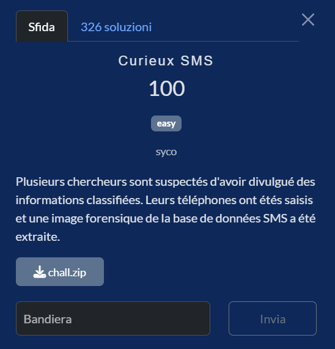
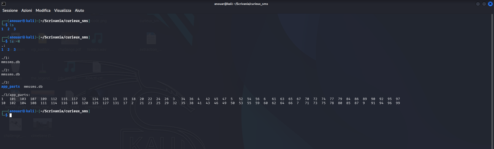
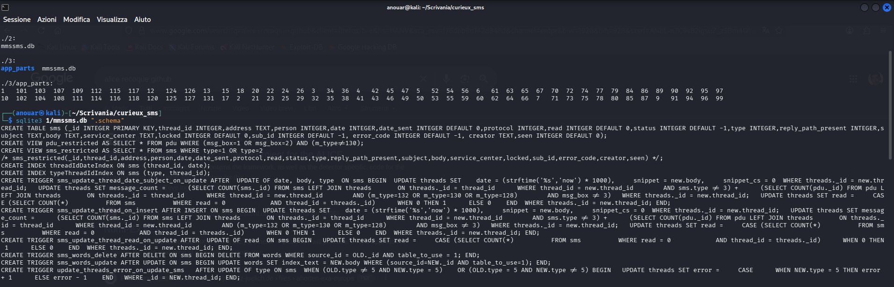
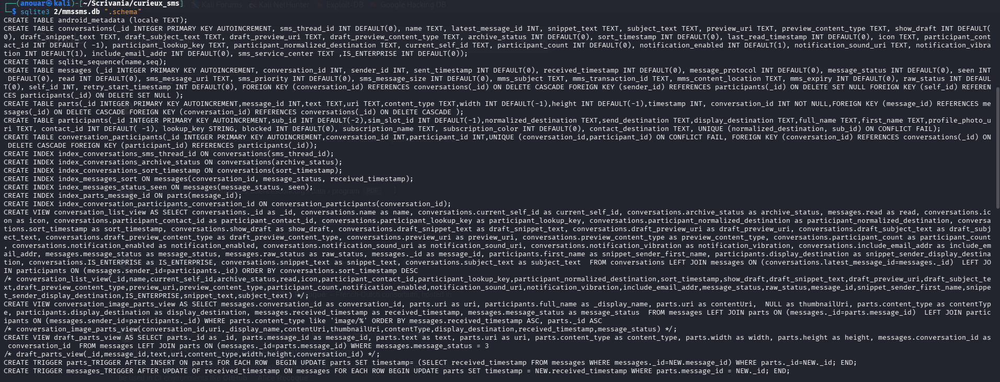
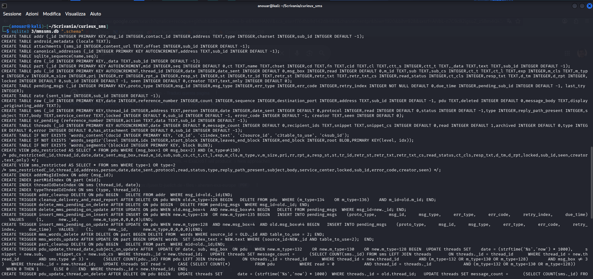
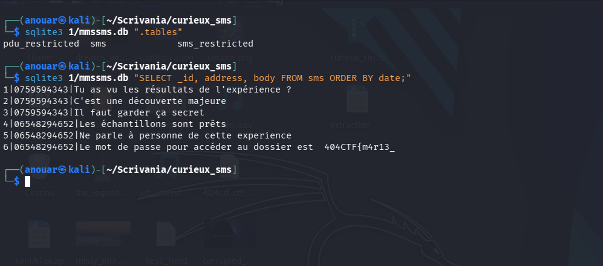
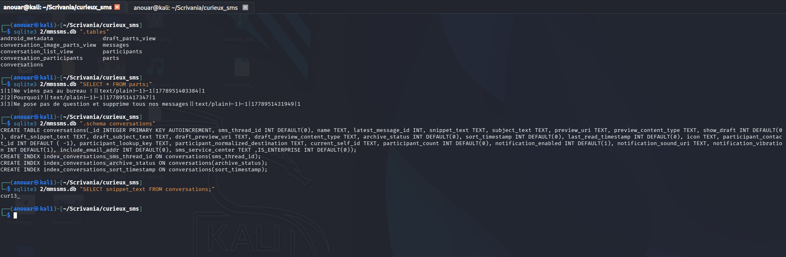
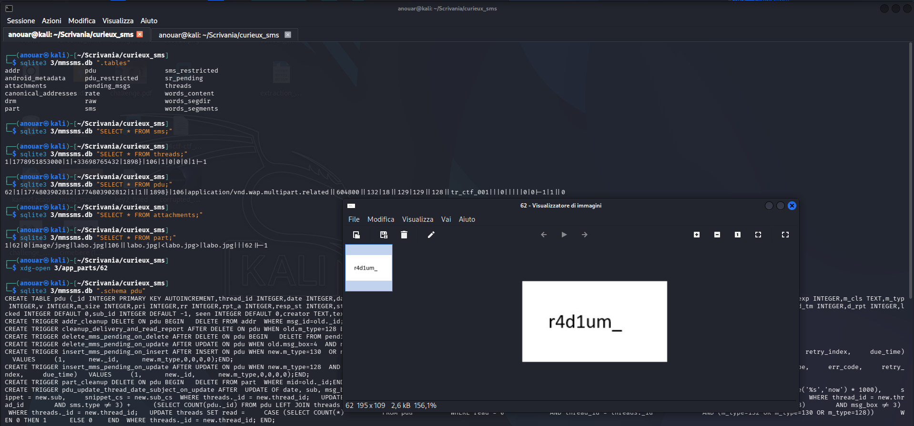
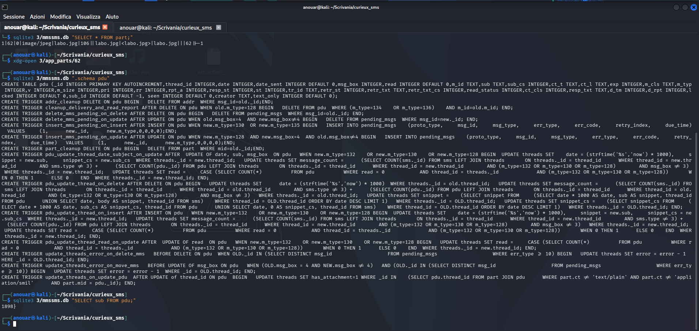

# Curieux SMS

**Competizione:** 404CTF 2026 <br>
**Categoria:** Forensic



---

## Soluzione

### Analisi
Dall’archivio ZIP fornito vengono estratti tre database SQLite, tutti denominati `mmssms.db`. Si tratta del database standard utilizzato da Android per conservare SMS e MMS, normalmente situato in: `/data/data/com.android.providers.telephony/databases/mmssms.db`.



Per capire l’origine dei tre dispositivi, è sufficiente confrontare lo **schema** di ciascun database:




Quando si osservano i tre database, si capisce subito che provengono da dispositivi molto diversi tra loro.

Il primo appartiene chiaramente a uno **smartphone legacy**, un Android di vecchia generazione (probabilmente pre‑Lollipop). Lo schema è quello storico di Android:

- tabella `sms`

- nessuna tabella MMS (`pdu`, `part`, `addr`)

- nessuna struttura moderna (`conversations`, `participants`, ecc.)

È la versione **ridotta** dello schema AOSP originale.

Il riferimento ufficiale AOSP (TelephonyProvider) è questo:
https://android.googlesource.com/platform/packages/providers/TelephonyProvider/

MmsSmsDatabaseHelper è un file Java che contiene le CREATE TABLE originali: https://android.googlesource.com/platform/packages/providers/TelephonyProvider/+/refs/heads/main/src/com/android/providers/telephony/MmsSmsDatabaseHelper.java

Il secondo database arriva da un **telefono moderno**, tipicamente Android 10 o superiore. Non utilizza più lo schema AOSP, ma quello introdotto da Google Messages (e adottato anche da Samsung).

Il codice sorgente dello **schema moderno**:
https://cs.android.com/android/platform/superproject/+/main:packages/apps/Messaging/

File con le CREATE TABLE:
https://cs.android.com/android/platform/superproject/+/main:packages/apps/Messaging/src/com/android/messaging/datamodel/DatabaseHelper.java

Il terzo rappresenta un **dispositivo stock AOSP**, cioè un Android “puro” senza personalizzazioni OEM: https://android.googlesource.com/platform/packages/providers/TelephonyProvider/

A differenza del db1 (versione ridotta), qui lo schema AOSP è completo:

- `pdu`
- `part`
- `part`
- `addr`
- `threads`
- gestione allegati MMS tramite `app_parts/`

### Telefono 1 (`1/mmssms.db`)



Nel primo dispositivo, basato su uno schema AOSP legacy, i messaggi sono memorizzati nella tabella `sms`.

Il sesto messaggio contiene la **prima parte della flag**: `404CTF{m4r13_`

### Telefono 2 (`2/mmssms.db`)



Nel secondo dispositivo il sospettato ha tentato di cancellare i messaggi dalla tabella `parts`, ma non ha considerato che lo schema moderno di Google Messages mantiene una **cache persistente** nella tabella `conversations`.

**Seconda parte della flag**: `cur13_`

### Telefono 3 (`3/mmssms.db`)

Il terzo dispositivo utilizza lo schema AOSP completo per gli MMS, suddiviso in:

- **`pdu`**: l'envelope del messaggio (mittente, data, oggetto, tipo MIME)
- **`part`**: le parti del body (testo, immagini, allegati)
- **`app_parts/`**: i file binari degli allegati sul filesystem

La tabella `part` rivela un allegato JPEG:



Il file `app_parts/62` corrisponde all'allegato `labo.jpg`.

Aprendo l'immagine si legge chiaramente il testo:

**Terza parte della flag**: `r4d1um_`



Durante l’analisi, un ulteriore indizio emerge già dalla tabella `pdu`: il campo `sub` (subject) contiene un valore che termina con una parentesi graffa, un dettaglio **troppo sospetto** per essere ignorato.

**Quarta e ultima parte della flag**: `1898}`


---

## Flag

```
404CTF{m4r13_cur13_r4d1um_1898}
```
