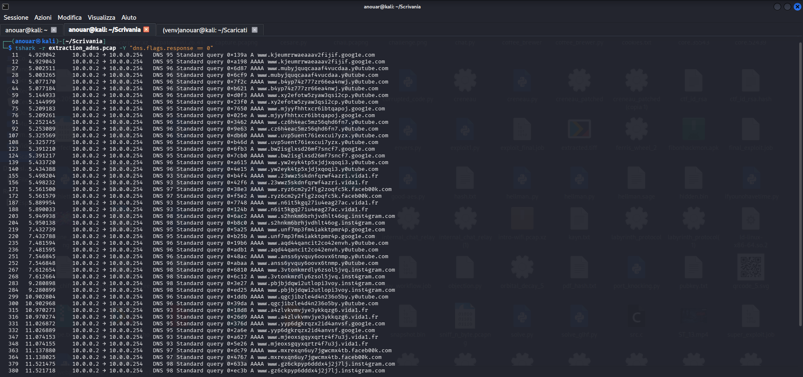
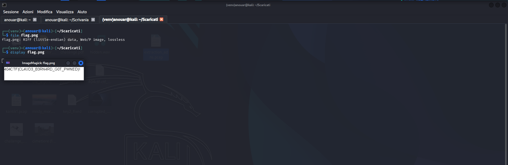

# Extraction d'ADNs

**Competition:** 404CTF 2026 <br>
**Category:** Forensics


---

## Solution

### Initial Analysis

A capture file `challenge.pcap` is provided.

To quickly identify any anomalies in DNS traffic, we filter directly for **DNS queries**:

```bash
tshark -r challenge.pcap -Y "dns.flags.response == 0"
```


The output immediately shows a fairly suspicious pattern: numerous DNS queries to domains that mimic legitimate services but contain numbers instead of letters (**typosquatting**):

- goog1e.com
- y0utube.com
- faceb00k.com
- inst4gram.com
- vida1.fr

Each DNS query contains a **seemingly random subdomain**, composed exclusively of Base32 alphabet characters. None of the subdomains contain digits disallowed in Base32 (0, 1, 8, 9) and the length of the fragments is compatible with Base32 blocks except for the last one.

The presence of these fragments suggests they are carrying encoded data, most likely as part of a **DNS tunneling** exfiltration mechanism.


### Reconstructing the Base32 Stream via DNS Tunneling

Since each DNS query contains a different fragment but with the same structure, it is reasonable to interpret them as **consecutive parts of a Base32 stream used for exfiltration**.

The strategy consists of **concatenating all subdomains in the order of the queries** and decoding them as a single Base32 payload.

```python
import base64

subdomains = [
    "kjeumrrwaeaaav2fijif", "mubyjquqcaaaf4vucdaa", "b4yp74z777zr66ea4nwj",
    "xy2efotw5zyaw3qsi2cp", "mjyyfhhtxcr6ibtqapoj", "cz6h4eac5mz56qhd6fn7",
    "uvp5uent76iexcui7yzx", "bw2isglxsd26mf7sncf7", "yw2eyk4tp5xjdjxqoqi3",
    "23wwz5skdnfqrwf4azri", "ryz6cm2y2flg2zoqfc5k", "n6it5kgq27iu4eag27ac",
    "s2hnkm6brhjvdhlt46og", "unf7mp3fm4iakktpmr4p", "aqd44qancit2co42envh",
    "anss6yvquy6oovx6tnmp", "3vtonkmrdly6zsol5jvq", "pbjbjdqwi2utlopi3voy",
    "qgcjibzle4d4n236o5by", "a4zlvkvmvjye3ykkqzg6", "yyp6dgkrqzx2id4anvsf",
    "mjeoxsgqyxqrtr4f7u3j", "mxrexqn6uy7jgwcmx4tb", "gz6ckpyp6dddx4j2j7lj",
    "tjnx54keoutur6e5p3vi", "77j7i4aaa"
]

payload = "".join(subdomains).upper()
pad_len = (8 - len(payload) % 8) % 8
payload += "=" * pad_len

data = base64.b32decode(payload, casefold=True)

with open("flag.png", "wb") as f:
    f.write(data)
```

> **Note:** the last chunk (`77j7i4aaa`) is 9 characters long and cannot be decoded individually (Base32 requires multiples of 8). For this reason it is necessary to treat the entire concatenation as a single Base32 stream and apply padding **only at the end**.

### File Identification



The decoded file header begins with: `RIFF....WEBP`, the unmistakable signature of a **WebP** image.

And yes, I know: in the script I saved it as flag.png because renaming the extension required an emotional effort that at that moment I was not ready to face. Fortunately display does not judge and opens everything anyway.

---

## Flag

```
404CTF{CL4UD3_B3RN4RD_G0T_PWNED}
```