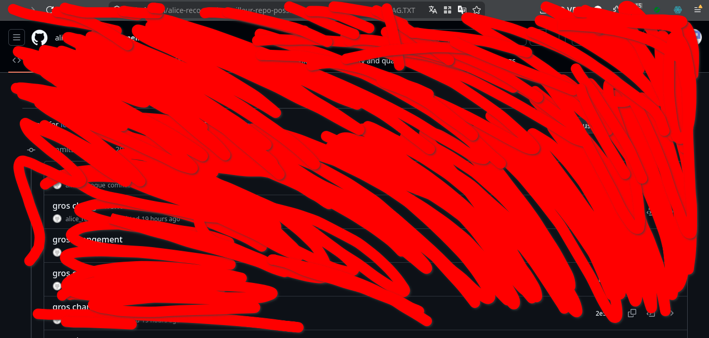
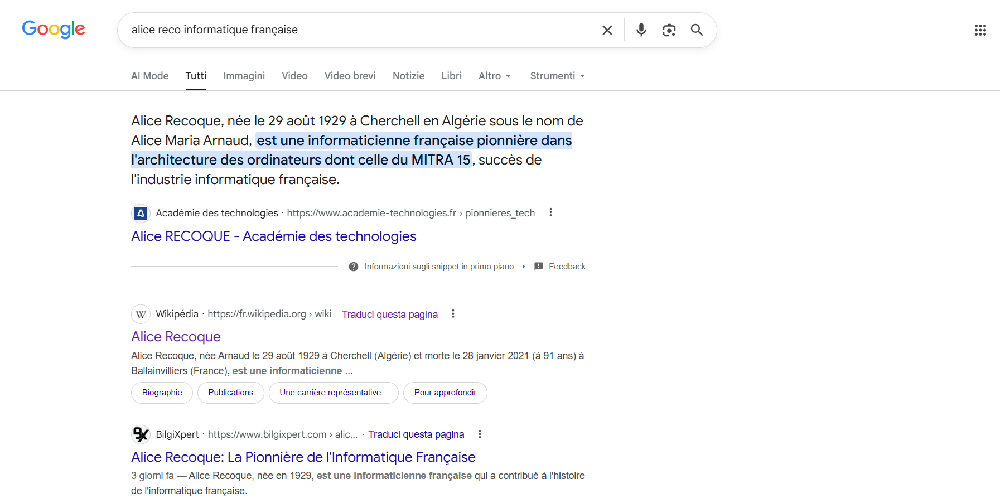
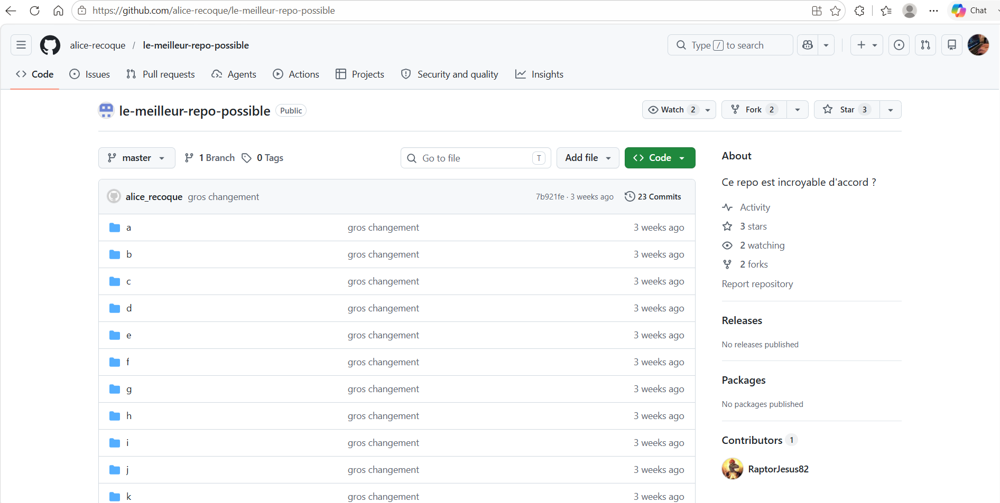
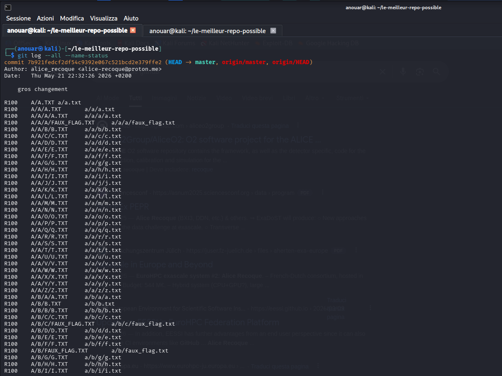
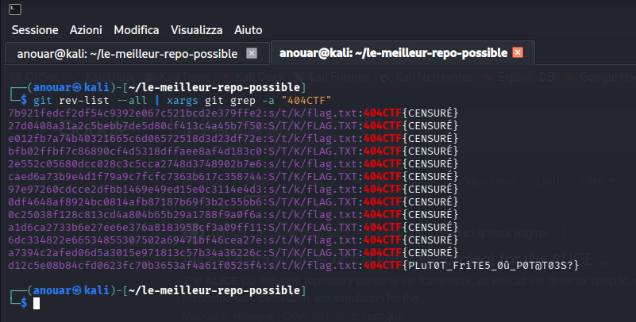

# C'était caché

**Competition:** 404CTF 2026 <br>
**Category:** OSINT


---

## Solution
### Reconstructing the censored image


The challenge provides an image showing a screenshot of a public repository, almost entirely covered by large red scribbles. Zooming in, however, you can still make out something in the URL bar: fragments like `alice-reco...`, `...ileur-repo-pos...` and at the end `FLAG.TXT`. Some commits are also visible. The rest is covered.

Ok, `alice-reco` + "grande dame française de l'informatique", I searched on Google:

```
alice reco informatique française
```


First result: **Alice Recoque**, a pioneer of French computing, one of the first women to work on mainframe computers in the 1960s–70s.

The URL fragment was clearly `alice-recoque` as a username.



Her GitHub profile contains a single public repository: `le-meilleur-repo-possible` (exactly what was visible in the `...ileur-repo-pos...` fragment).

The screenshot also showed a commit list, all with messages along the lines of "gros ch…", made by `alice-r...`, with one committed roughly 19 hours earlier. Additionally, the URL bar still showed `FLAG.TXT`, which clearly pointed to a file inside the repository.

### Exploring the Git history

```bash
git clone https://github.com/alice-recoque/le-meilleur-repo-possible.git
cd le-meilleur-repo-possible
```

After cloning the repository, the first step is to analyze the full commit history. To do so we use:
```bash
git log --all --name-status
```
This command shows the entire repo history, including for each commit the list of modified, added, or removed files.



The output is huge: many renames appear, all following the same pattern, from uppercase to lowercase, e.g. `R100 A/A/A.TXT a/a/a.txt`.

At this point I decide to search for the string 404CTF across the entire history, including every commit:

```bash
git rev-list --all | xargs git grep -a "404CTF"
```



Using `git rev-list --all | xargs git grep`, we identified the file `s/t/k/flag.txt` (written as `S/T/K/FLAG.TXT` in older commits) as the one containing the flag. Looking at the history, almost all subsequent commits show the value `CENSURÉ`.

This behavior indicates that Alice Recoque realized she had accidentally published the flag in plaintext on a public repository. To fix it, she started replacing the content with `CENSURÉ` in later commits, but without removing the previous versions from the history. As a result, the original flag can still be recovered by inspecting the older commits.

---

## Flag


```
404CTF{PLuT0T_FriTE5_0û_P0T@T03S?}
```