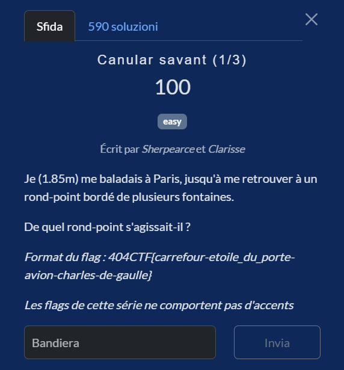
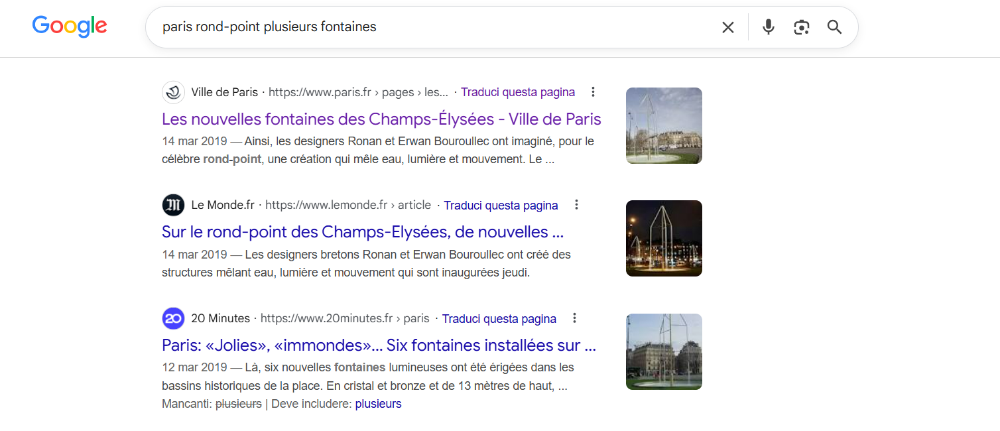
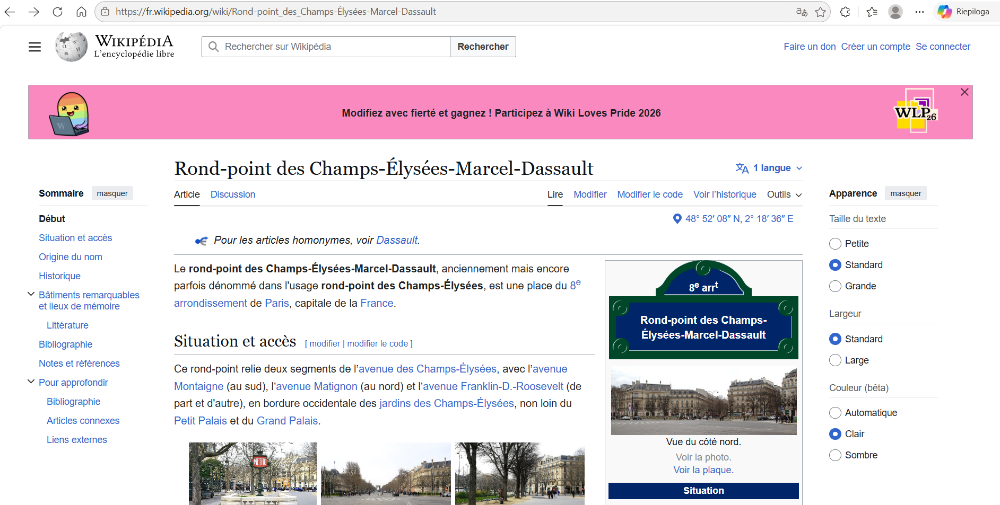

# Canular savant (1/3)

**Competition:** 404CTF 2026 <br>
**Category:** OSINT



---

## Solution

I opened Google and tried a search along the lines of:

```
paris rond-point plusieurs fontaines
```

Among the first results, the Champs-Élysées came up right away. It was a fairly intuitive choice given the elements provided: Paris, fountains, and a rond-point all point directly to the **rond-point des Champs-Élysées**, which is the most iconic one and features six symmetrically arranged fountains.



I immediately tried:
```
404CTF{rond-point_des_champs-elysees}
```

What did I get wrong?

Maybe the full name was needed. I opened the Wikipedia page for the rond-point des Champs-Élysées and found out that since 1991 the official name is **"Rond-point des Champs-Élysées-Marcel-Dassault"**. That's why my flag wasn't being accepted.




I tried again:

```
404CTF{rond-point_des_champs-elysees-marcel-dassault}
```

Finally, it's correct.

---

## Flag

```
404CTF{rond-point_des_champs-elysees-marcel-dassault}
```