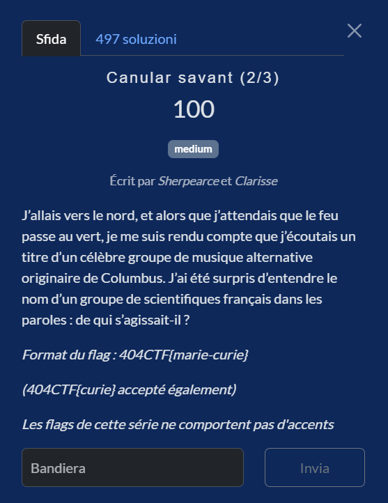
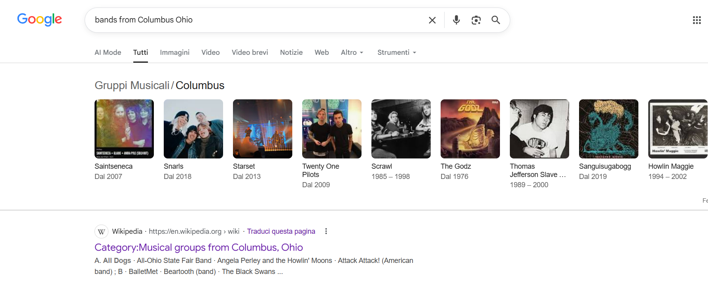
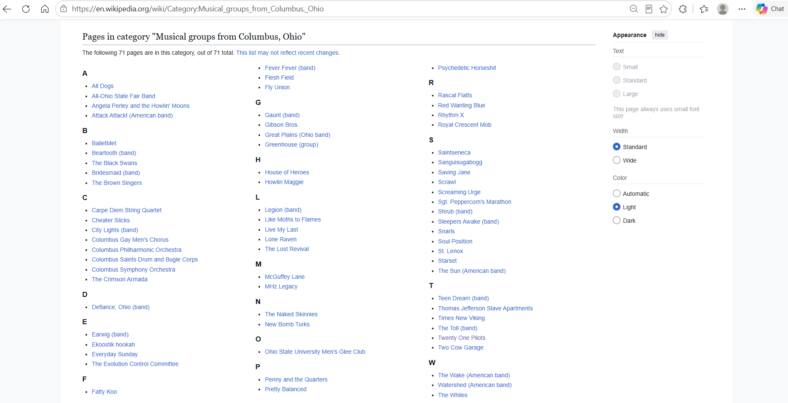
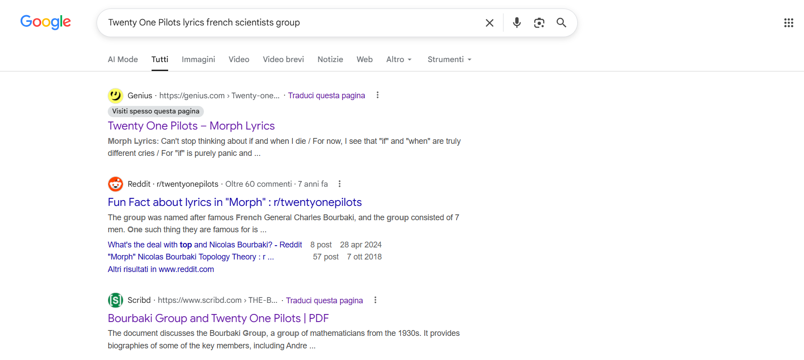
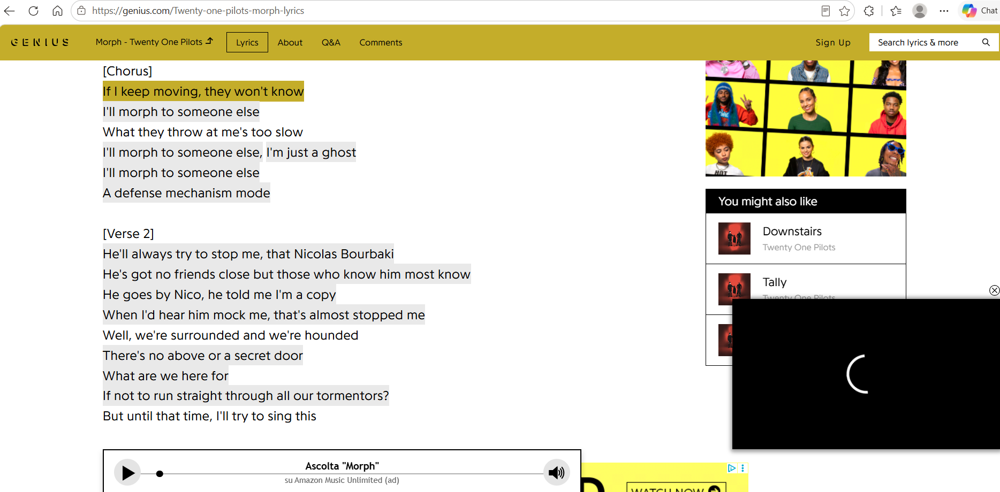
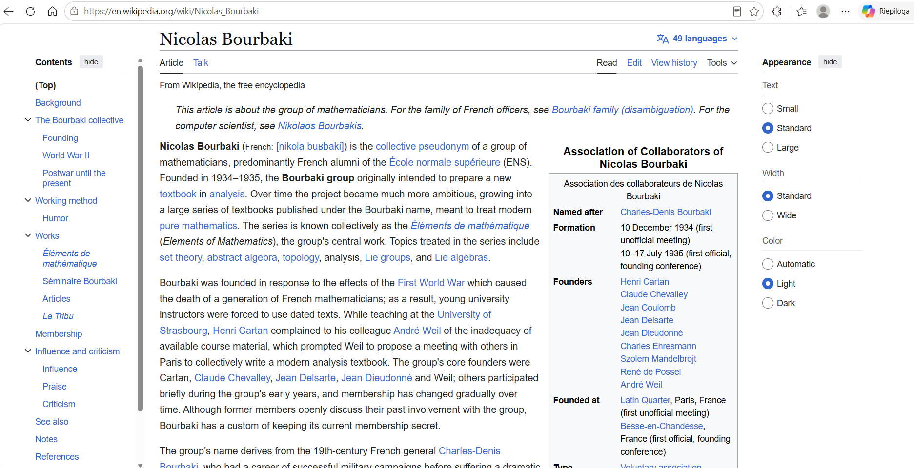

# Canular savant (2/3)

**Competition:** 404CTF 2026 <br>
**Category:** OSINT



---

## Solution
### Looking for alternative bands from Columbus
The first thing I did was ask myself which well-known alternative bands come from Columbus. A quick Google search gave me a few interesting names.


For completeness, I also opened the Wikipedia page dedicated to the city's musical artists, to get a broader list.



Honestly I barely knew any of them, so I decided to start with the most famous: **Twenty One Pilots**.

### Searching for references in Twenty One Pilots lyrics

After identifying Twenty One Pilots as the most famous band from Columbus, I tried to check whether any of their songs mentioned French scientists. I started with a targeted search:

```
Twenty One Pilots lyrics french scientists group
```


The first result points to the lyrics of **Morph** from the album *Trench* (2018).



In the second verse there is an explicit reference to **Nicolas Bourbaki**.

First "wait, what?" moment. I had never heard of Bourbaki in a musical context.


### Who the hell is Nicolas Bourbaki

To understand the reference, I opened the Wikipedia page and started reading.



I immediately discover that Nicolas Bourbaki **is not a real person**, but the collective pseudonym of a group of mathematicians (almost all French) founded in Paris in the 1930s.

Among the founding members are Henri Cartan, Claude Chevalley, Jean Delsarte, Jean Dieudonné and André Weil, all former students of the École Normale Supérieure.

Then I noticed something that made me laugh: the name "Bourbaki" was chosen because of a **canular**, an academic prank from the 1920s. Some guy had disguised himself as a professor with a fake beard and delivered a mathematics lecture deliberately full of nonsense and errors, signing it "Bourbaki".

The challenge is called **"Canular savant"**. The title was already the hint, I just hadn't connected it yet.

---


## Flag


```
404CTF{nicolas-bourbaki}
```