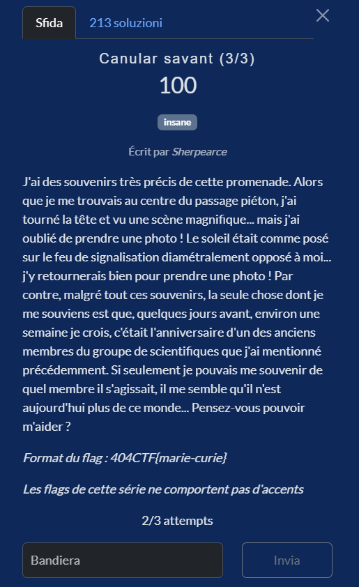
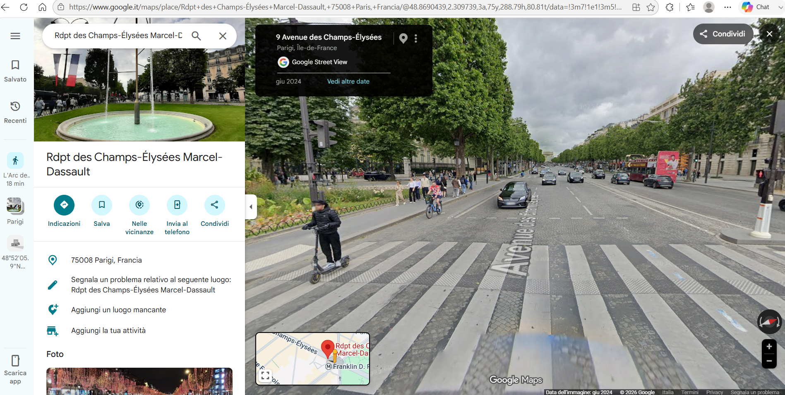
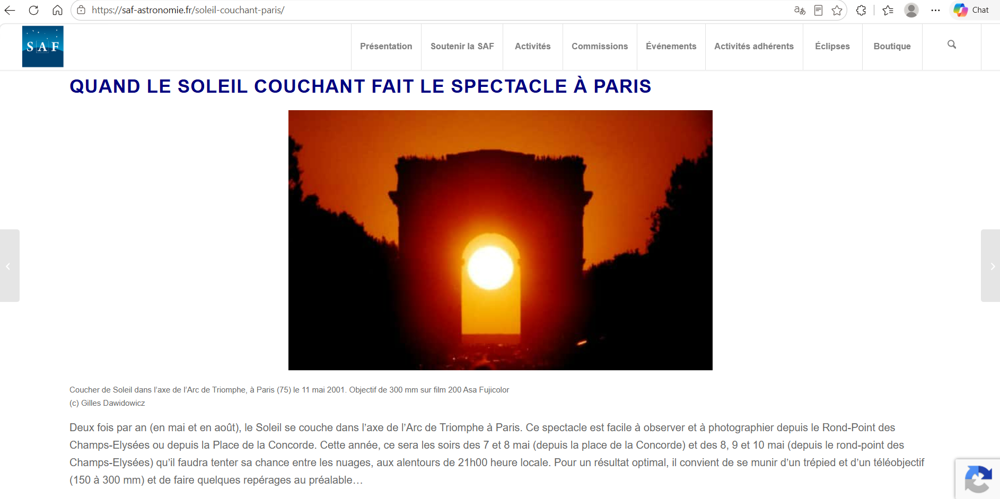
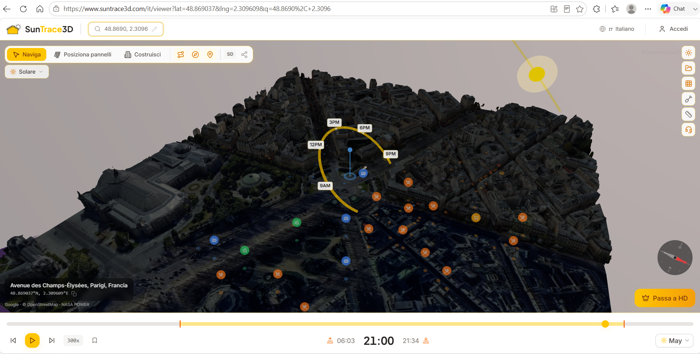

# Canular savant (3/3)

**Competizione:** 404CTF 2026 <br>
**Categoria:** OSINT



## Soluzione

## Geolocalizzazione del crosswalk

Da Canular Savant 1 sappiamo che il punto di partenza è il **Rond-point des Champs-Élysées-Marcel-Dassault**. Da Canular Savant 2 sappiamo che la persona si muove **verso nord**.

Nella traccia di Canular Savant 3 compare un indizio interessante: il sole era “appoggiato” sul semaforo diametralmente opposto a me.

Questa immagine mi ha fatto subito pensare a quelle foto iconiche che circolano online, in cui il sole si allinea perfettamente con un monumento.

A Parigi, il fenomeno più famoso di questo tipo è proprio il **tramonto perfettamente allineato con l’Arc de Triomphe**, visibile lungo l’asse dei Champs‑Élysées.



Per confermare l’intuizione ho cercato su Google:
```
soleil couchant arc de triomphe paris rond-point
```

e sono arrivato a questo articolo della SAF (https://saf-astronomie.fr/soleil-couchant-paris/):



Il testo conferma esattamente ciò che descrive la challenge: girando la testa verso ovest, la persona vede il sole tramontare perfettamente allineato con l’Arc de Triomphe, come se fosse “posato” sul semaforo dall’altro lato della strada.

### Primo errore di ragionamento
L’articolo della SAF indica chiaramente che l’allineamento del sole con l’asse dei Champs‑Élysées avviene **due volte l’anno: in maggio e in agosto**.
Da qui ho fatto il mio primo passo falso: se siamo a maggio, ho pensato che la finestra di maggio fosse appena passata o stesse finendo, quindi la prossima occasione utile sarebbe stata ad agosto.

A quel punto ho cercato tra i membri Bourbaki chi avesse il compleanno a cavallo tra fine luglio e inizio agosto:

- Henri Cartan: 29 luglio 1904

- Jacques Tits: 12 agosto 1930

Il ragionamento sembrava coerente, così ho provato la flag:

```
404CTF{henri-cartan}
```

Sbagliato, un tentativo bruciato.

### Tentiamo la pista di maggio
La passeggiata descritta nella challenge avviene intorno al **10 maggio 2026**.



Per verificare l’allineamento solare ho aperto SunTrace3D https://www.suntrace3d.com/it/viewer?lat=48.869037&lng=2.309609&q=48.8690%2C+2.3096

Ho posizionato il pin esattamente sul punto delle strisce pedonali: **48.8690, 2.3096**.

Impostando la data al **10 maggio 2026** e trascinando il cursore del tempo verso le **21:00**, è chiaro: la **linea gialla** che collega il punto al sole punta precisamente verso nord‑ovest, seguendo l’asse dei **Champs‑Élysées**.

### I membri di Bourbaki

La frase "environ une semaine avant" indica chiaramente un compleanno attorno al **3–4 maggio**.

A questo punto ho aperto la pagina Wikipedia di Nicolas Bourbaki, guardando la biografia di ognuno:

```
https://en.wikipedia.org/wiki/Nicolas_Bourbaki
```

e ho iniziato a scorrere la lista dei membri noti cercando chi fosse nato **all'inizio di maggio**.

Ho trovato due candidati perfettamente compatibili:

| Nome | Data di nascita | Delta con ~10 maggio |
|------|----------------|----------------------|
| **Claude Chabauty** | 4 maggio 1910 | ~6 giorni |
| **André Weil** | 6 maggio 1906 | ~4 giorni |

Il mio secondo tentativo (sbagliato) è stato **Claude Chabauty**. A quel punto ho incrociato le dita e provato l’altro nome: **André Weil**. Per fortuna, era lui.

---

## Flag

```
404CTF{andre-weil}
```