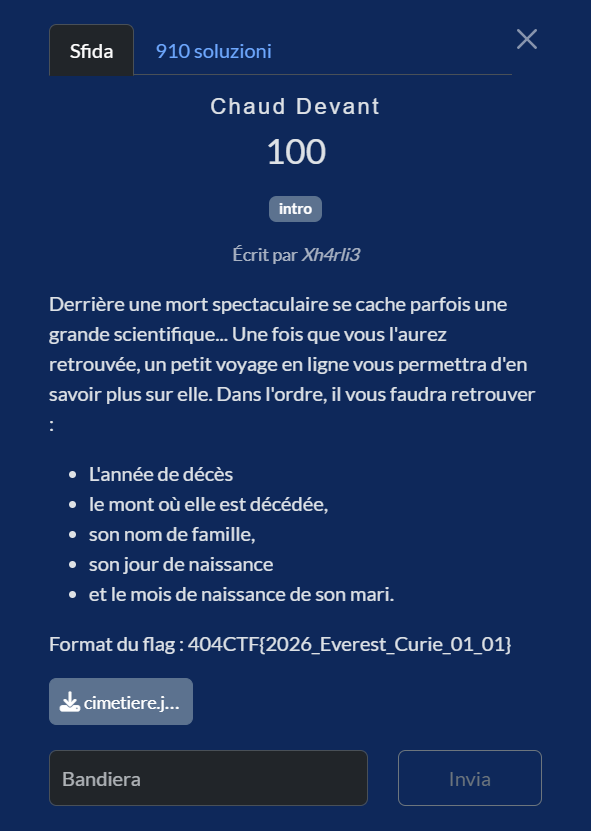
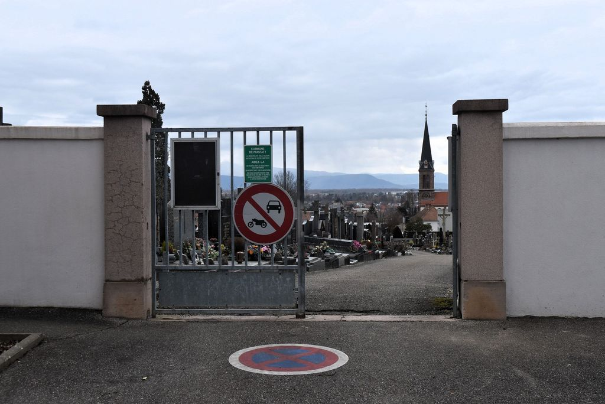
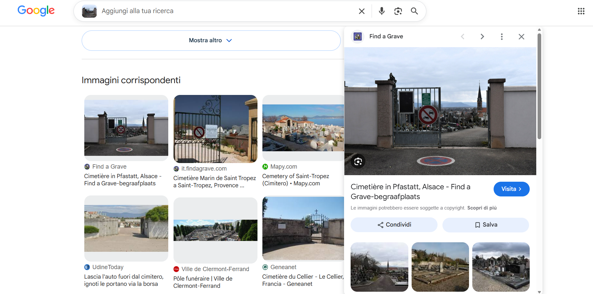
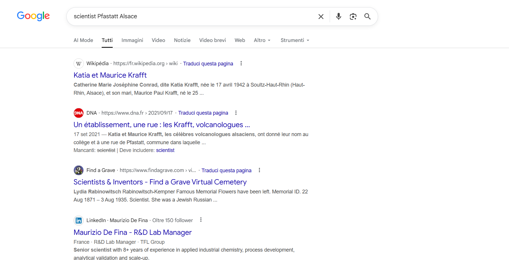
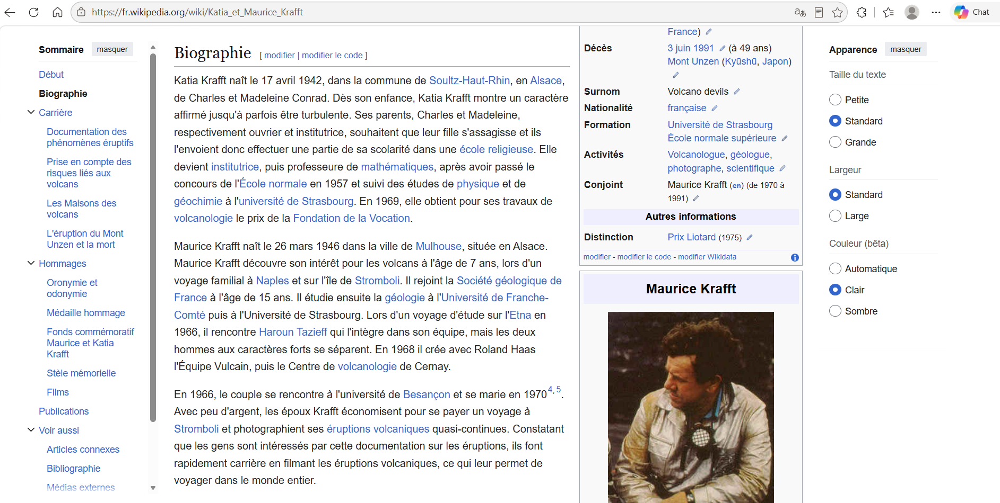

# Chaud Devant

**Competizione:** 404CTF 2026 <br>
**Categoria:** OSINT



---
## Soluzione

### Geolocalizzazione dell'immagine

L'immagine che ci viene fornita in allegato come vedete mostra l'ingresso di un cimitero con:

- un **cartello verde** che, una volta ingrandito, riporta la dicitura **COMMUNE DE PFASTATT**;
- un **cancello metallico** con segnali di divieto di accesso ai veicoli;
- una **chiesa con campanile** ben visibile sullo sfondo.

Caricando l’immagine nella funzione "Ricerca tramite immagine" di Google (che utilizza Google Lens), la prima corrispondenza visivamente simile che otteniamo è la seguente:



Possiamo confermare che il cimitero si trova proprio a **Pfastatt**, comune del Haut-Rhin in Alsazia, nella periferia nord-ovest di Mulhouse.


### Identificazione della scienziata

Cercando sempre su Google scienziati legati a Pfastatt, il primo risultato che compare è la pagina Wikipedia dedicata a Katia e Maurice Krafft



Dalla pagina otteniamo tutte le informazioni necessarie per ricostruire la flag.



Un aspetto curioso è proprio il titolo della challenge, che mi ha subito incuriosito non essendo francese. Dopo una breve ricerca ho scoperto che **Chaud devant** è un’espressione francese usata soprattutto in cucina per avvertire che si sta passando con un piatto caldo. In questo contesto, chiaramente è un gioco di parole che rimanda al calore estremo tipico delle eruzioni vulcaniche e delle colate piroclastiche (nuées ardentes)

---

## Flag

```
404CTF{1991_Unzen_Krafft_17_03}
```
