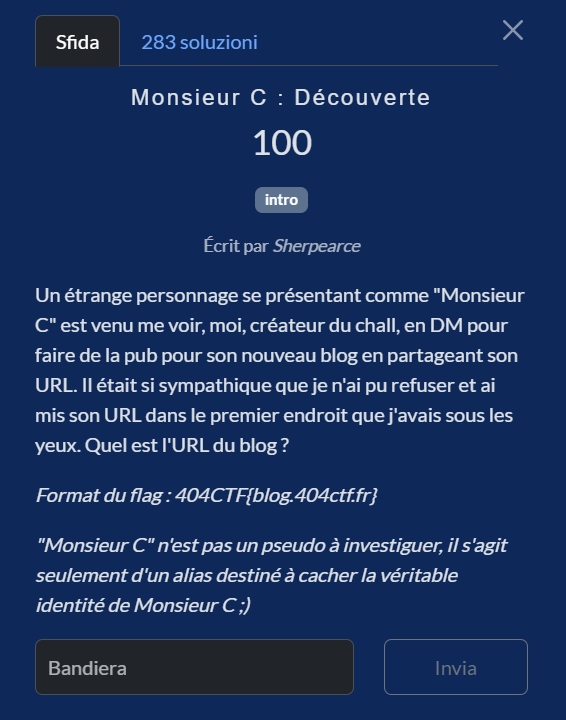
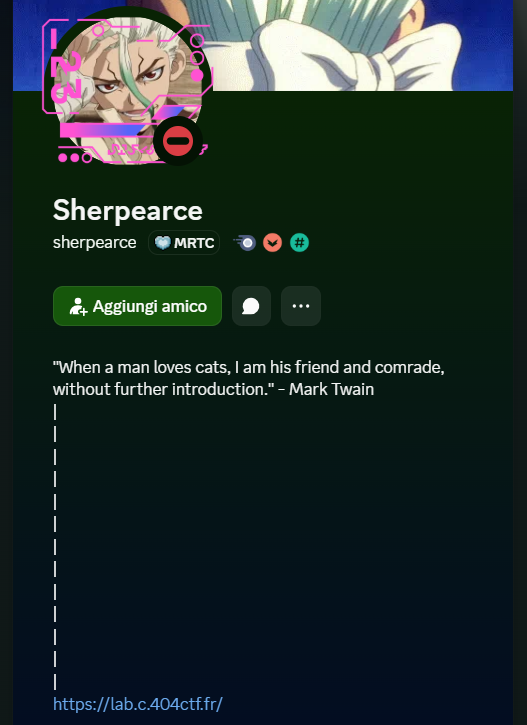

# Monsieur C : Découverte

**Competition:** 404CTF 2026 <br>
**Category:** OSINT



---

## Solution

We know the challenge author is active on Discord and received a private message, so it's natural to check whether they left any reference to the blog directly on their profile. The first thing I checked was indeed the bio of their account, where a link appears pointing to the blog itself.



---

## Flag

```
404CTF{https://lab.c.404ctf.fr/}
```