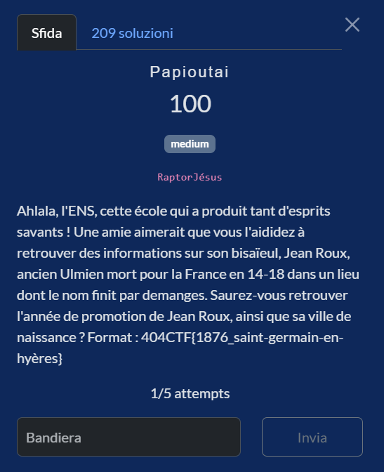
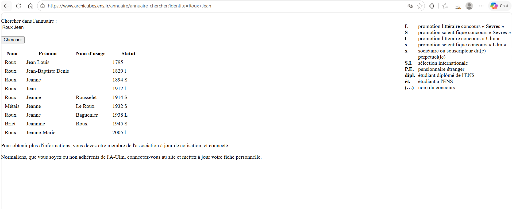
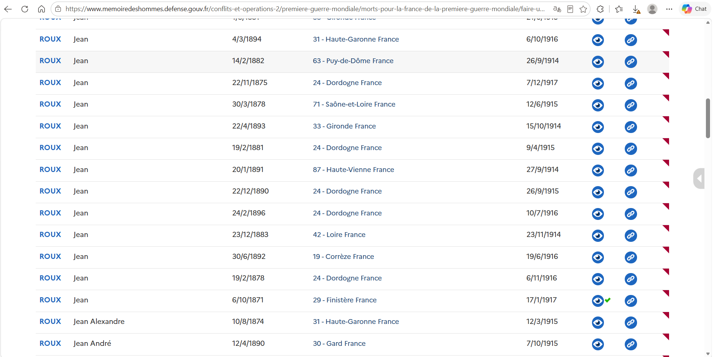
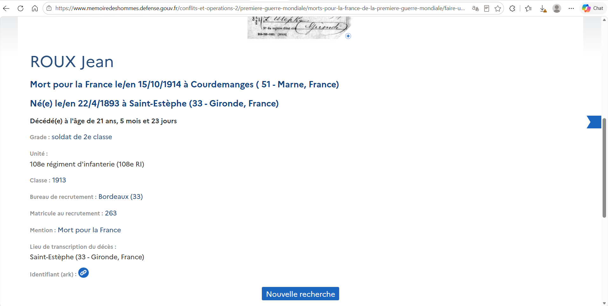

# Papioutai

**Competition:** 404CTF 2026 <br>
**Category:** OSINT



---

## Solution

### The ENS alumni directory

I'll admit that the moment I saw the title "Papioutai", my brain immediately started playing Stromae on autoplay: "Papa où t'es?". Jokes aside, the idea of the challenge is to find someone's great-grandfather.

The first obvious step is to find the graduation year of the "Ulmien" mentioned. "Ulmien" refers to a former student of the École Normale Supérieure in Paris (ENS Ulm), and fortunately there is an online alumni directory at archicubes.ens.fr.

I went to: https://www.archicubes.ens.fr/lannuaire and searched for `Roux Jean`.
The result was this:



The letter `l` indicates the promotion littéraire of the Ulm entrance exam. The correct candidate is clearly **Jean Roux, 1912 l**.

The only problem is that the city of birth is not listed in the directory. So the investigation continues.

### Reasoning about the birth year

I tried to reason about age. A normalien from the **1912 promotion**, how old could he have been? Students typically enter ENS around **19–20 years old**, after two years of prépa. So our Jean Roux was likely born somewhere between **1891 and 1893**.

To verify, I opened the search on Mémoire des Hommes (https://www.memoiredeshommes.defense.gouv.fr/recherche-globale/rechercher-dans-les-bases-nominatives) and searched simply for `Roux` and `Jean`, without any filter on place of death. Then I started scrolling through the entire list, filtering **manually** by birth year.
Spoiler: there were about thirty of them. The Great War did not spare Jean Rouxes.



The candidates falling within the right range are:

```
Jean    31/3/1891   dep. 17 (Charente-Maritime)   died 18/10/1914
Jean    22/4/1893   dep. 33 (Gironde)              died 15/10/1914
Jean    30/6/1892   dep. 19 (Corrèze)              died 19/6/1916
```

The first two died in October 1914, i.e. in the **very first months of the war**: perfectly plausible for an ENS student just called up.

### Opening the permalinks one by one

Each result on Mémoire des Hommes had an ARK permalink of the form:
```
https://www.memoiredeshommes.defense.gouv.fr:443/ark:40699/m005239ff9658531.moteur=...
```

I opened several by hand. The first ones were ordinary soldiers who died in unrelated places. I was actually about to give up and look in another database when I opened the one for Jean born on 22/4/1893 in Gironde:
https://www.memoiredeshommes.defense.gouv.fr/conflits-et-operations-2/premiere-guerre-mondiale/morts-pour-la-france-de-la-premiere-guerre-mondiale/faire-une-recherche?detail=4309972



And there… bingo.

**Courdemanges**, the name **ends with "demanges"**.

Recruited in Bordeaux, died at 21 in October 1914. Everything checks out: born in 1893, ENS promotion 1912 (at age 19) and fell at Courdemanges during the autumn 1914 fighting on the Marne.

Saint-Estèphe is also the famous wine village in the Bordeaux region, in the Médoc area. A useless detail, but it made me smile.

## Flag


```
404CTF{1912_saint-estèphe}
```