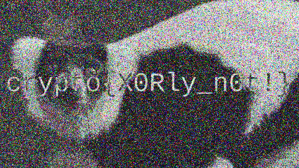

# Lemur XOR

**Competition:** CryptoHack<br>
**Category:** Crypto

---

## Description

> Two images have been encrypted by XOR-ing their RGB bytes with the same secret key. Recover the hidden content by performing a visual XOR between the RGB bytes of the two images.

Two files are provided: `lemur.png` and `flag.png`. Both appear as random coloured noise, the expected visual result of XOR encryption with a pseudorandom key.

---

## Theoretical Background

### XOR encryption of images

Let $K$ be a secret key interpreted as a sequence of bytes, and let $P_1$, $P_2$ be two plaintext images. Their encrypted versions are:

$$C_1 = P_1 \oplus K, \qquad C_2 = P_2 \oplus K$$

where $\oplus$ denotes the bitwise XOR applied element-wise to each RGB byte of the image.

### Key cancellation

By the self-inverse property of XOR ($x \oplus x = 0$ and $x \oplus 0 = x$), XOR-ing the two ciphertexts together cancels the key:

$$C_1 \oplus C_2 = (P_1 \oplus K) \oplus (P_2 \oplus K) = P_1 \oplus P_2 \oplus (K \oplus K) = P_1 \oplus P_2$$

The result is independent of $K$. We do not recover a single plaintext image, but rather the XOR of the two plaintexts — which is sufficient to reveal visible structure when the two images are sufficiently different (e.g. a photo and a flag with large uniform regions).

### Why reusing a key is dangerous

This attack is a direct consequence of **key reuse**. If the same key $K$ is used to encrypt two different messages, an attacker who obtains both ciphertexts can eliminate the key entirely with a single XOR operation. This is the image-domain analogue of the classical *two-time pad* attack on stream ciphers.

---

## Solution

### Script

```python
#!/usr/bin/env python3

from PIL import Image
import numpy as np

img1 = np.array(Image.open("lemur.png"))
img2 = np.array(Image.open("flag.png"))

xored = np.bitwise_xor(img1, img2)

result = Image.fromarray(xored.astype(np.uint8))
result.save("xor_result.png")
```

**Step 1.** Both images are loaded and converted to NumPy arrays of shape `(327, 582, 3)`: height × width × RGB channels, with dtype `uint8` (values in $\{0, \dots, 255\}$).

**Step 2.** `np.bitwise_xor()` applies the operation $c_1 \oplus c_2$ element-wise to every byte of the three colour channels simultaneously.

**Step 3.** The resulting array is converted back to an image and saved.

### Result

XOR-ing the two encrypted images reveals a lemur photograph and a flag overlaid on each other, exactly $P_1 \oplus P_2$. The flag is legible because the flag image contains large regions of uniform colour: where $P_2$ is constant, $P_1 \oplus P_2$ retains the full structure of $P_1$, and vice versa.

---

### Flag

</img>