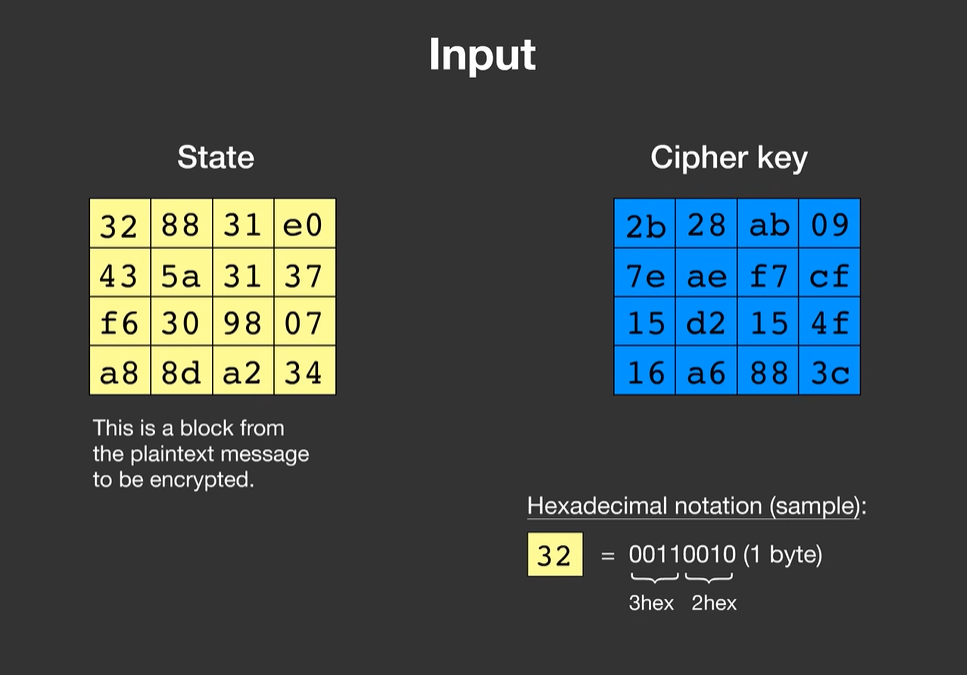
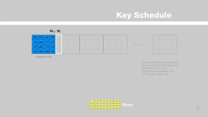
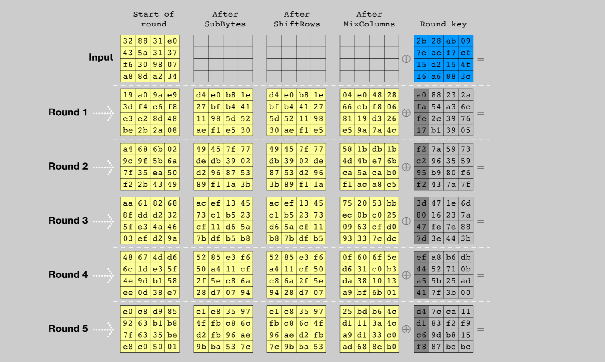
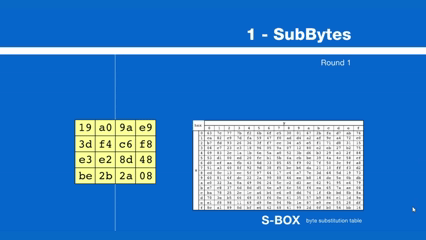
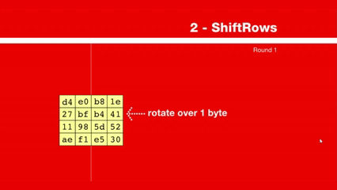
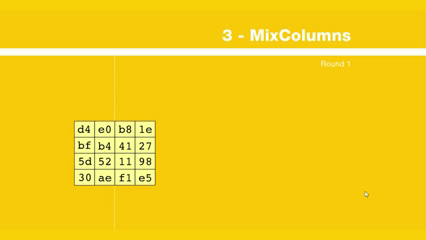
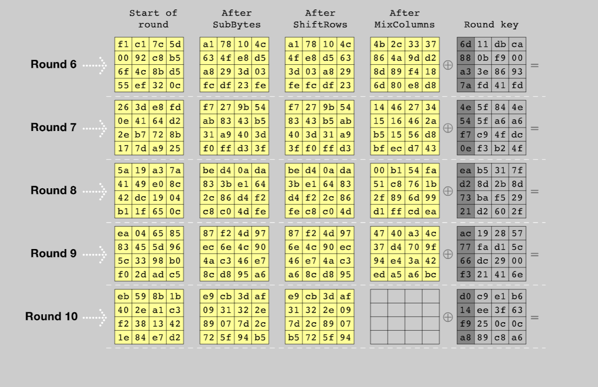

# Structure of AES

**Competition:** CryptoHack<br>
**Category:** Crypto

---

## Description

> Write a `matrix2bytes` function to convert a 4×4 matrix of integers back into a 16-byte array, and submit the resulting plaintext as the flag.

A Python file is provided with a `bytes2matrix` function already implemented. The inverse `matrix2bytes` must be written and applied to the given matrix to recover the flag.

---

## Theoretical Background

### AES-128: structure overview

AES-128 encrypts a 128-bit (16-byte) plaintext block using a 128-bit key. The plaintext is arranged as a **4×4 matrix of bytes** (the *state*) and transformed through a sequence of rounds. Each round applies four invertible operations that together provide confusion and diffusion, the two properties identified by Claude Shannon in the 1940s as necessary for a secure cipher.

For a more visual understanding of the process, see this animation:
https://formaestudio.com/rijndaelinspector/archivos/Rijndael_Animation_v4_eng-html5.html



The full encryption pipeline is:

**1. Key Expansion (Key Schedule)**
From the 128-bit key, 11 separate 128-bit *round keys* are derived — one for each `AddRoundKey` step (initial + 10 rounds).



**2. Initial AddRoundKey**
The state is XOR-ed with round key 0 before any rounds begin.



**3. Rounds 1–9 (main rounds)**
Each of the 9 main rounds applies four steps in sequence:

- **SubBytes**: each byte of the state is replaced by a different byte according to a fixed nonlinear substitution table (the S-box). This provides *confusion*: it obscures the relationship between the key and the ciphertext.



- **ShiftRows**: the last three rows of the state matrix are cyclically shifted left by 1, 2, and 3 positions respectively. This ensures bytes from different columns mix across rounds.



- **MixColumns**: each column of the state is treated as a polynomial over $\text{GF}(2^8)$ and multiplied by a fixed matrix. This provides *diffusion*: each output byte depends on all four input bytes of the column.



- **AddRoundKey**: the state is XOR-ed with the current round key.

**4. Final round (round 10)**
Identical to rounds 1–9, but **MixColumns is omitted**. This makes decryption structurally symmetric with encryption.



### State matrix layout

The 16 bytes of the plaintext are arranged in the state matrix **column by column**:

$$
\left[
\begin{array}{cccc}
b_0 & b_4 & b_8 & b_{12} \\
b_1 & b_5 & b_9 & b_{13} \\
b_2 & b_6 & b_{10} & b_{14} \\
b_3 & b_7 & b_{11} & b_{15}
\end{array}
\right]
$$

Note the column-major ordering: bytes 0–3 fill the first column, bytes 4–7 the second, and so on. This is important when implementing `bytes2matrix` and `matrix2bytes` correctly.

In the provided implementation, `bytes2matrix` uses **row-major** ordering (each row of the matrix corresponds to 4 consecutive bytes), which is a valid and common simplification for challenge purposes.

---

## Solution

### Analysis of `bytes2matrix`

```python
def bytes2matrix(text):
    return [list(text[i:i+4]) for i in range(0, len(text), 4)]
```

This splits the 16-byte input into four consecutive 4-byte chunks, each becoming a row of the matrix. The inverse operation must reassemble those rows back into a flat byte sequence.

### `matrix2bytes` implementation

```python
def matrix2bytes(matrix):
    return bytes(val for row in matrix for val in row)
```

The nested generator expression iterates over each row, then over each value within that row, flattening the 4×4 matrix back into a sequence of 16 integers. `bytes()` converts the sequence into a `bytes` object.

### Full script

```python
#!/usr/bin/env python3

def bytes2matrix(text):
    return [list(text[i:i+4]) for i in range(0, len(text), 4)]

def matrix2bytes(matrix):
    return bytes(val for row in matrix for val in row)

matrix = [
    [99,  114, 121, 112],
    [116, 111, 123, 105],
    [110, 109, 97,  116],
    [114, 105, 120, 125],
]

print(matrix2bytes(matrix))
```

### Output

```
b'crypto{...}'
```

---

### Flag

```
crypto{...}
```

---

## Conclusions

This challenge establishes two utility functions: `bytes2matrix` and `matrix2bytes`. They will be reused in every subsequent AES challenge. The state matrix representation is the foundation on which SubBytes, ShiftRows, MixColumns, and AddRoundKey all operate.

The key takeaway about AES structure is that its security does not rest on a single elegant mathematical problem (as RSA rests on integer factorisation). Instead, it is built from many simple, fast, individually weak operations whose composition achieves strong confusion and diffusion.
