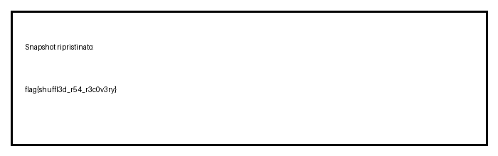

# Shuffled Snapshot

**Competition:** ITSCyberGame
**Category:** Crypto
**Files:** `snapshot.bin`, `pubkey.txt`

---

## Description

> You know when images get corrupted? Well this isn't exactly corruption — it's encrypted. EXTREMELY encrypted...

---

## Solution

### Step 1 — Inspect provided files

`pubkey.txt` contains an RSA public key:

```
n = 871013614924877797546595892294532560519922870857806731421802158788666364217562314967714182421931
e = 65537
```

The modulus `n` is only **319 bits**, far below any reasonable security threshold (2048 bits). This immediately suggests factorization is feasible.

`snapshot.bin` is a binary file of **5480 bytes** and is not recognized as a standard format:

```bash
$ file snapshot.bin
snapshot.bin: data
$ wc -c snapshot.bin
5480 snapshot.bin
```

### Step 2 — Ciphertext structure

`n` fits into **40 bytes** (319 bits → ceil to 40 bytes). Splitting the file:

```
5480 / 40 = 137 exact blocks
```

The file contains **137 RSA ciphertexts of 40 bytes each**, encrypted in ECB-style textbook RSA (no padding), so every block is independent.

### Step 3 — Factorization of n

With a 319-bit modulus, factoring is trivial with tools like `sympy`:

```python
from sympy import factorint
n = 871013614924877797546595892294532560519922870857806731421802158788666364217562314967714182421931
print(factorint(n))
```

Result:

```
p = 933281101772064062160042018090078644844919576771
q = 933281101772064062160042093647942370759242995961
```

Verify `p * q == n` and compute the private exponent:

```python
phi = (p - 1) * (q - 1)
d = pow(e, -1, phi)
```

### Step 4 — Decrypt blocks

Decrypt each 40-byte block with RSA textbook (`m = c^d mod n`) and represent the plaintext as **29 fixed bytes** (left-zero-padded):

```python
data = open('snapshot.bin', 'rb').read()
n_bytes = 40
chunks = [data[i:i+n_bytes] for i in range(0, len(data), n_bytes)]

plaintexts = []
for c in chunks:
    ct = int.from_bytes(c, 'big')
    pt = pow(ct, d, n)
    pt_bytes = pt.to_bytes(29, 'big')
    plaintexts.append(pt_bytes)
```

Each decrypted block has a fixed structure: **the first byte is an index** (0..136) and the remaining **28 bytes are payload**. The challenge title "Shuffled" refers to this: the blocks were shuffled and the index lets us reorder them.

Example:

```
Raw block 0:  idx=103, payload=88dd0775ebadb77674...
Raw block 1:  idx=107, payload=bf3d51fc1bfe2f7ef1...
Raw block 2:  idx= 25, payload=c8dcb9738bc728140a...
...
Raw block 37: idx=  0, payload=00000eea89504e470d0a1a0a...  ← PNG magic!
Raw block 38: idx=  1, payload=08020000001db3e567...
```

### Step 5 — Reorder and reconstruct

Sort the decrypted blocks by the index byte and concatenate the payloads:

```python
sorted_pts = sorted(plaintexts, key=lambda x: x[0])
reassembled = b''.join(pt[1:] for pt in sorted_pts)
```

The payload of index `0` begins with `00 00 0e ea 89 50 4e 47...`. The four bytes `00 00 0e ea` are an internal prefix; the PNG signature starts at `89 50 4e 47` (`\x89PNG`):

```python
png_start = reassembled.find(b'\x89PNG')
png_data = reassembled[png_start:]
```

Verified PNG structure:

```
IHDR — 700×220, 8-bit RGB
IDAT — 3761 bytes compressed (zlib OK)
IEND — end
```

### Step 6 — Image

The reconstructed PNG is valid and opens correctly. The image (700×220, RGB) contains the flag string directly, visible without further processing.

---

## Flag



---

## Conclusion

The challenge chained three weaknesses: a tiny 319-bit RSA modulus (factorable in seconds), textbook RSA used per-block without padding (ECB-style), and shuffled blocks with an embedded index. After factoring `n`, decrypting, and reordering the blocks, the PNG was reconstructed and the flag was revealed.
