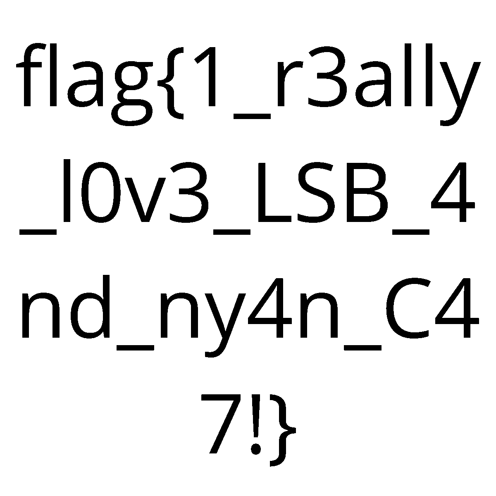

# Is that a...?

**Competition:** ITSCyberGame  
**Category:** Crypto  
**File:** `pdf.csv`

---

## Description

> Sorry folks, what are magic bytes anyway? Anyhow, to find the flag you'll likely face more obstacles... if you can find it at all.

---

## Solution

### Step 1 — Inspect the provided file

The file is named `pdf.csv`, suggesting a CSV or PDF, but that filename is misleading. The first step is to check the magic bytes (file signature):

```bash
$ file pdf.csv
pdf.csv: PNG image data, 976 x 549, 8-bit/color RGB, non-interlaced
```

The magic bytes `89 50 4E 47 0D 0A 1A 0A` indicate a **PNG** file (`\x89PNG`). Rename to `pdf.png` and continue.

### Step 2 — Hidden metadata in PNG chunks

PNG files are composed of chunks, each identified by a 4-byte type. Besides standard chunks (`IHDR`, `IDAT`, `IEND`), auxiliary chunks like `iTXt` and `eXIf` can carry metadata. Inspect non-standard chunks; the `eXIf` chunk and an `iTXt` with key `Make` contain:

```
"password:kd2paqx0jx"
```

### Step 3 — ZIP appended after IEND

The `IEND` chunk marks the official end of the PNG; any data after it is ignored by viewers. Search for the ZIP signature `PK\x03\x04` after `IEND`:

```python
pk_pos = data.find(b'PK\x03\x04')
zip_data = data[pk_pos:]
with open('hidden.zip', 'wb') as f:
    f.write(zip_data)
```

The extracted ZIP is AES-encrypted (method 99), so use `pyzipper` to open it with the password found in the metadata:

```python
import pyzipper
with pyzipper.AESZipFile('hidden.zip') as z:
    print(z.namelist())  # ['HELLOTHERE.png']
    z.extractall('.', pwd=b'kd2paqx0jx')
```

### Step 4 — Stego on HELLOTHERE.png

`HELLOTHERE.png` is a 1200×1200 RGBA image. Extract the least significant bit (LSB) plane of each channel (R,G,B,A); LSB steganography typically hides data there. Example with Pillow + NumPy:

```python
from PIL import Image
import numpy as np
img = Image.open('HELLOTHERE.png')
arr = np.array(img)
for ch, name in enumerate(['R','G','B','A']):
    plane = ((arr[:,:,ch] & 1) * 255).astype(np.uint8)
    Image.fromarray(plane, 'L').save(f'lsb_{name}.png')
```

Viewing the LSB planes reveals the flag directly.

---

## Flag



---

## Conclusion

This challenge layered techniques: a false file extension detected via magic bytes, a password in non-standard PNG metadata, an AES-encrypted ZIP appended after `IEND`, and LSB steganography in the extracted image. Each step unlocked the next, leading to the flag.
